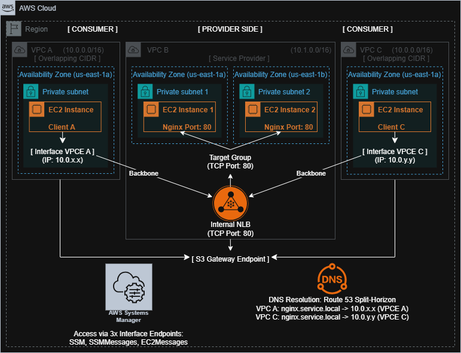
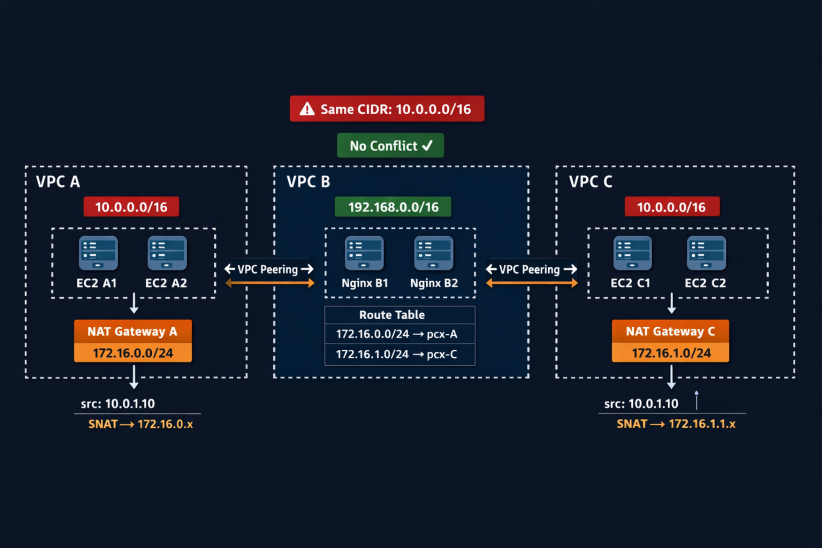

# 🚀 AWS PrivateLink Solution: Overlapping CIDR Challenge



## 📌 Overview
Project ini mendokumentasikan implementasi **AWS PrivateLink** sebagai solusi teknis untuk mengatasi konflik routing pada VPC dengan CIDR identik (**VPC A & VPC C: 10.0.0.0/16**). Arsitektur ini mengadopsi prinsip **Zero Trust & Cost-Efficient**, memastikan layanan tetap terisolasi tanpa memerlukan Internet Gateway, NAT Gateway, maupun Public IP.

### 🌐 Network Topology
| Component | CIDR / Role | Function |
| :--- | :--- | :--- |
| **VPC A (Consumer)** | `10.0.0.0/16` | Client Environment (Overlapping) |
| **VPC C (Consumer)** | `10.0.0.0/16` | Client Environment (Overlapping) |
| **VPC B (Provider)** | `10.1.0.0/16` | Nginx Service Environment (HA Setup) |

---

## 🎯 Key Takeaways
* **Overlapping Resolution:** PrivateLink menghindari ketergantungan pada routing Layer 3 (CIDR) ❌.
* **Layer 4 Communication:** Konektivitas berjalan di level TCP melalui AWS Backbone Network.
* **Service-Level Abstraction:** Fokus berpindah dari *network-peering* ke *service-access*.
* **Egress Control:** Menggunakan **S3 Gateway Endpoint** untuk manajemen paket OS tanpa biaya NAT Gateway.
* **Zero Inbound Management:** Akses terminal via **AWS Systems Manager (SSM)** tanpa membuka port 22 (SSH).
* **High Availability (HA):** Implementasi Multi-AZ di sisi Provider untuk redundansi layanan.

---

## 💡 Arsitektur Logic (The Golden Answer)
### ❓ Mengapa Tidak Terjadi Konflik Routing?
AWS PrivateLink bekerja di **Layer 4 (TCP)** dan tidak menggunakan tabel routing antar VPC.
1. Setiap Consumer VPC memiliki **Interface Endpoint (ENI)** dengan IP lokal.
2. Trafik diarahkan ke **Network Load Balancer (NLB)** di Provider VPC via internal AWS backbone.
3. **Kesimpulan:** Karena tidak ada pertukaran rute CIDR antar VPC, konflik *overlapping* berhasil dieliminasi secara total.

---

## I. 🏗️ Persiapan Infrastruktur

### A. Provider (VPC B - 10.1.0.0/16)
1. **VPC Setup:** Create `VPC-B-Provider`.
2. **Multi-AZ Subnets:** * Private Subnet B1 (AZ `us-east-1a`)
   * Private Subnet B2 (AZ `us-east-1b`)
   * *Benefit:* Menjamin ketersediaan layanan jika salah satu AZ mengalami gangguan (*outage*).
3. **S3 Gateway Endpoint:** Associate ke Route Table VPC B agar EC2 bisa melakukan update package secara privat.

### B. Consumer (VPC A & VPC C - 10.0.0.0/16)
1. **VPC Setup:** `VPC-A-Consumer` & `VPC-C-Consumer`.
2. **DNS Settings:** Aktifkan **Enable DNS Hostnames** dan **Enable DNS Resolution**.
3. **Subnet:** Private Subnet di AZ yang sejajar dengan Provider (`us-east-1a`).

---

## II. 🔐 Konfigurasi Security Groups
*Menerapkan prinsip Least Privilege (Hanya membuka port yang diperlukan).*

### A. Provider (VPC B)
* **SG-Nginx-Provider:**
    * **Inbound:** TCP 80 ← Source: `10.1.0.0/16` (NLB Subnet).
    * **Outbound:** HTTPS 443 → Destination: **S3 Prefix List ID**.

### B. Consumer (VPC A & C)
* **SG-EC2-Client:**
    * **Inbound:** `None`.
    * **Outbound:** TCP 443 → `SG-VPCE-SSM` | TCP 80 → `SG-VPCE-Privatelink`.
* **SG-VPCE-SSM:**
    * **Inbound:** TCP 443 ← Source: `SG-EC2-Client`.
* **SG-VPCE-Privatelink:**
    * **Inbound:** TCP 80 ← Source: `SG-EC2-Client`.

---

## III. ⚙️ Deployment Compute & Load Balancer

### A. Provider Side (VPC B)
1. **EC2 Nginx Server (x2):** Deploy satu instance di AZ `1a` dan satu di AZ `1b`.
   * **Role:** `AmazonSSMManagedInstanceCore`.
   * **User Data:** Install nginx & create custom index page.
2. **Network Load Balancer (NLB):** * Scheme: **Internal**. 
   * Listener: TCP 80 → Target Group: EC2 Nginx (Include both instances).

### B. Consumer Side (VPC A & C)
1. **EC2 Client:** IAM Role `AmazonSSMManagedInstanceCore`. Gunakan `SG-EC2-Client`.

---

## IV. 🔗 Implementasi AWS PrivateLink

### A. Endpoint Service (Provider - VPC B)
1. Hubungkan ke Internal NLB.
2. Enable: **Acceptance Required**.
3. Catat **Service Name**.

### B. Interface Endpoints (Consumer Side)
1. **SSM Endpoints (3 Required):** `ssm`, `ssmmessages`, `ec2messages`.
   * **Setting:** **Enable Private DNS names: YES**.
2. **Nginx Interface Endpoint:**
   * **Setting:** **Enable Private DNS names: NO** (Dikelola manual via Route 53).
   * **Subnet Selection:** Pilih AZ yang sesuai dengan lokasi EC2 Client.

### C. DNS Mapping (Split-Horizon Strategy)
1. **VPC A:** Create PHZ `service.local` -> Associate ke VPC A. Create Record `nginx` (Alias) -> Target: VPCE A DNS.
2. **VPC C:** Create PHZ `service.local` -> Associate ke VPC C. Create Record `nginx` (Alias) -> Target: VPCE C DNS.

---

## V. 🧪 Testing & Verification

1. **Acceptance:** Pada VPC B, **Accept** semua koneksi di menu *Endpoint Connections*.
2. **Connectivity Test:**

### 1. DNS Check
```bash
nslookup nginx.service.local
```

### 2. Port Check
```bash
timeout 2 bash -c '</dev/tcp/nginx.service.local/80' && echo "PORT OPEN"
```

### 3. HTTP Validation
```bash
curl -Iv http://nginx.service.local
```

Expected Result: `HTTP/1.1 200 OK`.

3. **HA Validation:** Matikan EC2 Nginx di AZ `1a`.
   - Lakukan `curl` kembali dari Client. Layanan harus tetap bisa diakses melalui EC2 di AZ `1b`.

## ⚖️ Trade-offs Analysis: PrivateLink vs. NAT Gateway + Peering

Dalam menangani *Overlapping CIDR*, terdapat dua pendekatan utama. Berikut adalah analisis perbandingan antara solusi **AWS PrivateLink** (Project ini) dengan solusi **NAT Gateway + VPC Peering** (Traditional SNAT):

### 🔄 Comparison Table



| Fitur | **AWS PrivateLink** (Our Solution) | **NAT Gateway + Peering** (Image Approach) |
| :--- | :--- | :--- |
| **Overlapping CIDR** | ✅ **Supported Native.** | ⚠️ **Complex SNAT.** |
| **Keamanan** | 🔒 **High (Service Isolation).** | 🔐 **Medium (Network Peering).** |
| **Biaya Fix** | 💰 **Low (Endpoint cost).** | 💸 **High (NAT Gateway hourly).** |
| **Akses Internet** | ❌ **No (Private Only).** | ✅ Yes **(Outbound enabled).** |

---

## 🏁 Final Conclusion

Arsitektur ini membuktikan bahwa komunikasi antar-VPC dapat dikelola secara efisien di level layanan (service-level), mengeliminasi kebutuhan internet publik dan NAT Gateway, sehingga menekan biaya operasional sekaligus memperkuat postur keamanan.

## 🧠 Author Notes
Implementasi oleh Deri Nugroho. Berfokus pada:
- Cloud-Native Design
- Cost Optimization (Zero NAT Gateway cost)
- High Availability & Resiliency (Multi-AZ Provider)
